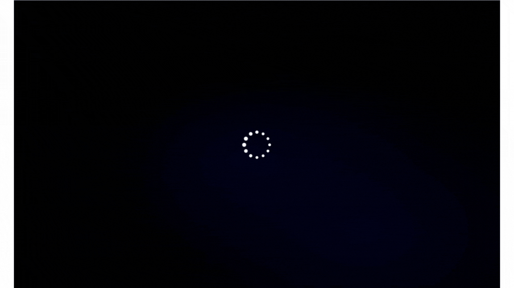

## EduExpo Digital Planetarium 

EduExpo Digital Planetarium is an interactive educational application designed to help students learn about the solar planetary system, including the universe, galaxies (like the Milky Way), stars, comets, and planets. It presents real-time data for each planet, including key details such as mass, diameter, gravity, rotation period, and mean temperature, creating an engaging and informative learning experience.

### Features

- **Interactive Planetary Models**: Visualize universe, galaxies, comets, stars and planets in an interactive way to enhance learning.
- **Real-Time Data**: Access accurate and up-to-date planetary information via NASA's API.
- **Educational Focus**: Aimed at students to provide a foundational understanding of our solar system and beyond
- **User-Friendly Interface**: Intuitive navigation and controls for a seamless user experience.
- **Responsive Design**: Fully responsive layout, accessible on desktop and mobile devices.

### Technologies Used

**Libraries and Tools:**

- **Three.js**: JavaScript library for 3D visualization.
- **Pure CSS Loaders**: CSS-based loading animations to improve user experience.
- **NASA API**: Fetch real-time data about planets and other celestial objects.

### Preview

### License
This project is licensed under the [MIT LICENSE](LICENSE). 
CopyRight © 2023 MBPT. All Rights Reserved.
